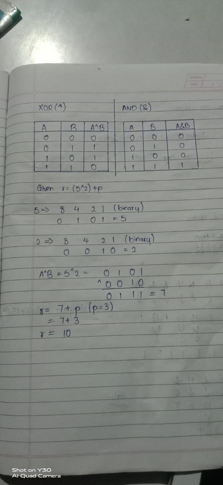
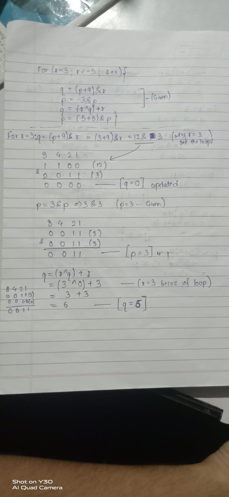
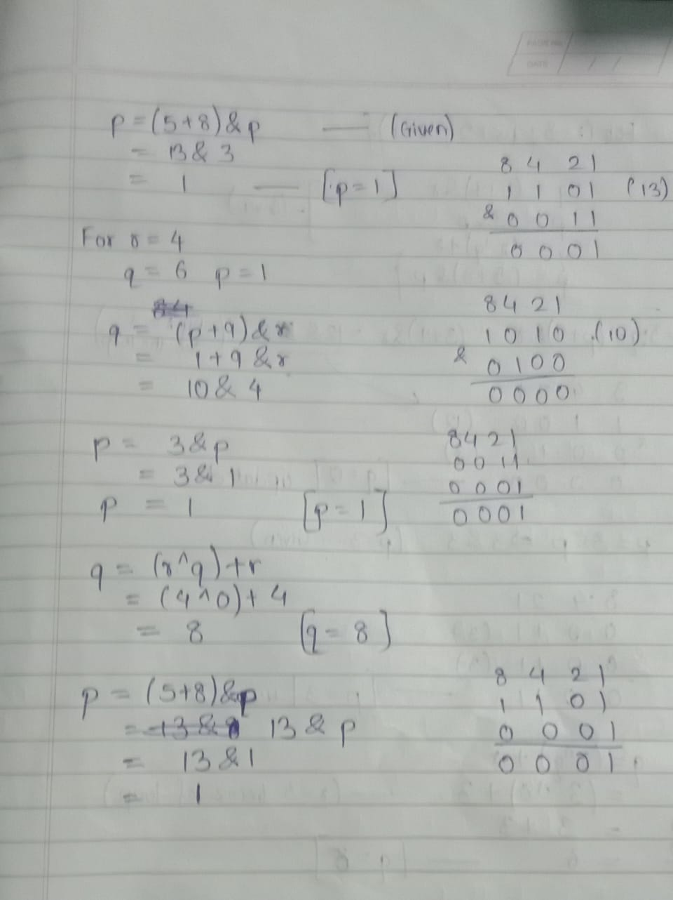
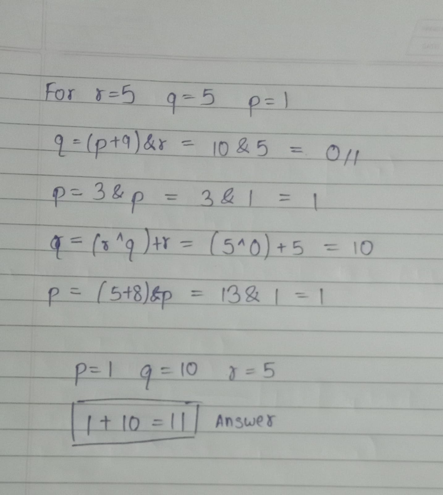

## Pseudo Codes
<pre>Integer p, q, r
set p=3, q=5, r=4
r=(5^2)+p
for(each r from 3 to 5)
	q = (p+9)&r
	p = 3&p
	q = (r^q)+r
	p = (5+8)&p
End for
Print p+q

# Options
9
11
57
37
</pre>

## Must know before solving
XOR Operator Truth Table(^):
| A | B | A XOR B |
|---|---|---------|
| 0 | 0 |   0     |
| 0 | 1 |   1     |
| 1 | 0 |   1     |
| 1 | 1 |   0     |

AND Operator Truth Table(&):
| A | B | A AND B |
|---|---|---------|
| 0 | 0 |   0     |
| 0 | 1 |   0     |
| 1 | 0 |   0     |
| 1 | 1 |   1     |

## Explaination

