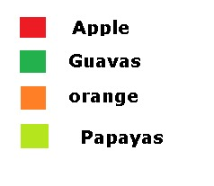
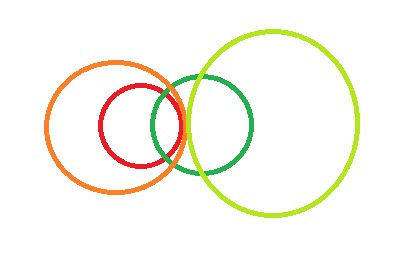

<pre><h2>
Statements:
I. Some apples are guavas.
II. All apples are oranges.
III. No orange is a papaya.
IV. All papayas are guavas.
Conclusions:
I. Some papayas are apples.
II. Some oranges are papayas.
III. Some guavas are oranges.
</h2>
<h3>
A. Only conclusion III follows
B. Either conclusion I or conclusion III follows
C. None follow
D. Only conclusion I follows
</h3></pre>

## Solution
Let consider 

 
The relation (Of Statments) would look like

If we counter the conclusion with statement  
then only 3 rd statement of conclusion (Some guavas are oranges.) follows

