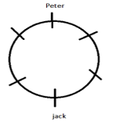
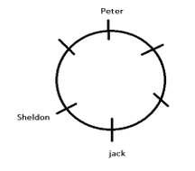
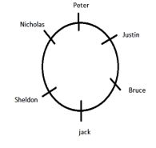

<pre>
<h2>Six friends - Sheldon, Jack, Justin, Bruce, Peter, and Nicholas are sitting around a circular table,
not
necessarily in the same order. All of them are facing the center.
I. Peter is sitting exactly opposite to Jack.
II. Justin is the only person sitting between Bruce and Peter.
III. Sheldon is sitting to the immediate left of Jack.
</h2><h3></h3>
Who is sitting to the opposite of Sheldon?
A. Bruce
B. Justin
C. Peter
D. Nicholas
<h3></pre>

## Solution
<h3> Using statement one I. Peter is sitting exactly opposite to Jack.
  

Using statement III. Sheldon is sitting to the immediate left of Jack.
  

By statement II. Justin is the only person sitting between Bruce and Peter.
  

Hence, Justin sitting to the opposite of Sheldon.</h3>
